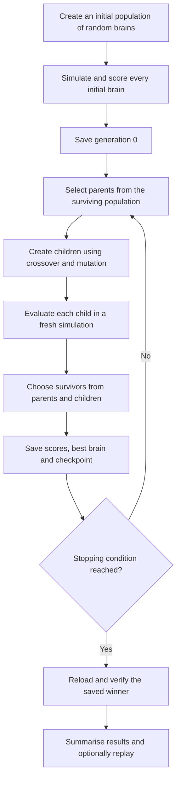

# Assignment 2: how our robot-brain algorithm works

This guide explains the implementation in
[A2_template_2026.py](A2_template_2026.py). It describes what the program actually
does, why the main choices matter, and how to run and interpret an experiment.

We are using **neuroevolution**: an evolutionary algorithm searches for the
weights of a neural network that controls a simulated snake. Each candidate
brain gets a fresh attempt at the same task. Brains that finish closer to the
target are more likely to contribute to the next generation.

The robot's body stays fixed. What evolves is the collection of numbers inside
its controller.

## Contents

1. [The task and what can change](#1-the-task-and-what-can-change)
2. [The two loops in the program](#2-the-two-loops-in-the-program)
3. [What the brain observes](#3-what-the-brain-observes)
4. [How observations become movement](#4-how-observations-become-movement)
5. [How a brain is stored and initialised](#5-how-a-brain-is-stored-and-initialised)
6. [One generation of evolution](#6-one-generation-of-evolution)
7. [How a trial is simulated and scored](#7-how-a-trial-is-simulated-and-scored)
8. [The four search modes](#8-the-four-search-modes)
9. [Stopping rules and evaluation budgets](#9-stopping-rules-and-evaluation-budgets)
10. [Workers, seeds and reproducibility](#10-workers-seeds-and-reproducibility)
11. [Saved files, replay and continuation](#11-saved-files-replay-and-continuation)
12. [Commands to run the program](#12-commands-to-run-the-program)
13. [Reading the output](#13-reading-the-output)
14. [Designing a fair experiment](#14-designing-a-fair-experiment)
15. [Where to find each part in the code](#15-where-to-find-each-part-in-the-code)
16. [What the results do and do not establish](#16-what-the-results-do-and-do-not-establish)

## 1. The task and what can change

The task is to move the robot's core close to a target within a fixed amount of
simulated time.

| Part | Current setup |
|---|---|
| Robot | The prebuilt `john_set.snake`, with eight actuated hinges |
| World | `OlympicArena`, regenerated with terrain seed 2026 |
| Starting XY position | `(0, 0)` metres |
| Starting orientation | 180 degrees of yaw, so the tail is behind the core and forward points toward world +X |
| Target XY position | `(2, 0)` metres |
| Time available per trial | 15 simulated seconds |
| Physics timestep | 0.002 seconds: 500 steps per simulated second |
| Score to minimise | Final core-to-target distance in the XY plane |
| Reported success radius | 0.10 m by default |
| Evolved values | 360 neural-network weights, including biases |

The nominal spawn is `[0, 0, 0.1]`. The world builder corrects the height to avoid
starting inside the floor, so the actual initial core height can differ from
0.1 m. The distance score uses X and Y only.

The red pole and yellow ball show the target. They have collisions disabled,
so they cannot push or obstruct the robot. The controller receives the target
coordinates directly; it does not need to identify the marker in a camera image.

The body, world, network architecture, clock frequencies and scoring rule are
fixed within a run. Changing a mutation setting changes **how we search for a
brain**, while changing the body or fitness changes the problem being solved.

The arena has flat, rugged and inclined sections. The selected target is still
at `(2, 0)`; changing worlds does not automatically move it to the finish line.
The assignment-local `_SeededOlympicArena` uses the same heightmap formula as
ARIEL's arena, but passes `TERRAIN_SEED` into its Perlin-noise generator. This
fixes the earlier behaviour where a new launch silently generated new ground.
No files in `src/ariel` are changed. Archived brains still replay on their own
saved model, including models generated before this fix.

## 2. The two loops in the program

There are two different processes, running at different scales.

**The control loop** runs inside one simulation. A fixed brain repeatedly reads
the robot state and produces hinge commands. Its weights do not change during
that trial.

**The evolutionary loop** runs around many simulations. It compares brains,
creates new weight vectors, evaluates them, and chooses which brains survive.



Within each simulation, the smaller loop is:

```text
Observe the state -> calculate hinge commands -> advance physics -> repeat
```

A brain can react to changing observations without learning during the trial.
Learning here means changing which weight vectors exist in the population
between trials. We do not use backpropagation, gradient descent or a neural
network training dataset.

Useful terms:

| Term | Meaning in this project |
|---|---|
| Brain/controller | The neural network that produces hinge commands |
| Gene | One adjustable network weight or bias weight |
| Genotype/chromosome | The flat list of all 360 genes |
| Individual | A chromosome together with its score and stored information |
| Population | The group of individuals currently competing and reproducing |
| Evaluation | One complete attempt by one candidate brain |
| Generation | One round of creating, evaluating and selecting a batch of children |
| Fitness | The score used to rank brains; smaller is better here |

## 3. What the brain observes

`_controller_inputs()` builds a vector of 36 numbers at each control update.
One of these is a constant bias input, so there are 35 changing observation or
task/time features plus that constant.

| Input group | Count | What it tells the controller | Scaling in the code |
|---|---:|---|---|
| Core orientation | 4 | How the core is rotated, represented by a quaternion | Included in `qpos[3:]`, clipped to `[-pi, pi]` and divided by `pi` |
| Hinge angles | 8 | How the eight joints are currently bent | Same clipping/division as orientation |
| Velocities | 14 | Linear/angular motion of the floating base and motion of the eight hinges | `tanh(qvel / 5)` |
| Target displacement | 2 | The X/Y differences between the target and the current core position | `tanh((target_xy - core_xy) / 2)` |
| Clock features | 4 | Sine and cosine signals at 0.75 Hz and 1.5 Hz | Already bounded between -1 and 1 |
| Elapsed time | 1 | What fraction of the trial has passed | `clip(time / duration, 0, 1)` |
| Heading error | 2 | Whether the robot faces toward the target, and which way it needs to turn | Sine and cosine of the signed planar angle |
| Bias | 1 | A constant input that allows learned offsets | Always 1 |
| **Total** | **36** | | |

The quaternion is four numbers representing a rotation; it is not four angles.
Its components already lie between -1 and 1 for a unit quaternion. The current
code still divides them by `pi` together with the hinge angles. This is the
implemented scaling, not a claim that it is the only or best normalisation.

The exact order is:

```text
orientation (4), hinge angles (8), velocities (14), target XY gap (2),
sin(0.75 Hz), sin(1.5 Hz), cos(0.75 Hz), cos(1.5 Hz),
elapsed fraction, heading sine, heading cosine, constant 1
```

Keeping inputs bounded helps prevent a feature with a large numerical range
from dominating the network. It does not guarantee good control.

### Why include the target and heading?

The target displacement gives the controller information about where it should
go. It is expressed in world X/Y coordinates. The heading pair gives a more
direct signal about the turn needed to face the target.

For this snake, forward is core-local **-X**, away from the tail. When the target
is straight ahead, the heading features are approximately `(0, 1)`. Sine/cosine
avoid a sudden numerical jump between angles near -180 and +180 degrees. If
the planar direction is undefined, such as exactly at the target, the code
returns a finite neutral pair `(0, 1)`.

### Why include clocks and elapsed time?

Locomotion needs coordinated changes over time. The sine/cosine inputs give the
network repeating signals it can use to generate rhythmic commands. Evolution
still has to discover which combinations move this body effectively.

Elapsed time provides different information: it distinguishes the beginning
from the end of the trial, even when the repeating clocks are at the same phase.

These features do not prescribe which joint must bend in which direction. The
controller remains a neural network with evolved weights, rather than a CPG
controller or a manually specified snake gait.

## 4. How observations become movement

The network has one hidden layer of eight units and eight outputs, one for each
hinge. A hidden unit forms a weighted combination of the inputs and passes it
through `tanh`, a smooth function bounded between -1 and 1.

The forward pass is:

```text
inputs  = the 36-element observation vector
hidden  = tanh(inputs @ W1)
outputs = tanh(append(hidden, 1) @ W2)
actions = outputs * (pi / 2)
```

`@` means matrix multiplication: each unit adds up the incoming values multiplied
by their weights. The extra `1` before the output layer provides output biases.
The input vector's own constant `1` provides hidden-layer biases.

The weight matrices have these sizes:

| Matrix | Purpose | Shape | Number of weights |
|---|---|---|---:|
| `W1` | Observations and input bias to hidden units | `36 x 8` | 288 |
| `W2` | Hidden units and output bias to hinges | `9 x 8` | 72 |
| **Total** | | | **360** |

Biases allow a unit to produce a nonzero response even when its other inputs
are zero. They are already included in these matrices; there are no additional
bias arrays outside the 360-gene chromosome.

Each output is scaled to between `-pi/2` and `+pi/2` radians, or -90 to +90 degrees.
For example, a network output of `0.5` becomes a command of +45 degrees.

The program writes these as **direct desired-angle commands**:

```python
data.ctrl[:] = actions
```

The simulated actuators and physics determine how the joints actually move
toward those angles. Setting a desired angle does not instantly teleport a
joint into that position. We do not accumulate small output increments onto
the previous command.

The network has no recurrent hidden state. Its responses depend on the current
inputs, including velocities and time; the robot and physics still carry state
from one timestep to the next.

## 5. How a brain is stored and initialised

Evolution works with a flat vector of 360 real numbers. `_decode()` reshapes
the first 288 into `W1` and the remaining 72 into `W2`.

```text
360-gene chromosome -> W1: 36 x 8, W2: 9 x 8 -> working controller
```

On a fresh run, every gene is drawn independently from a normal distribution
with mean 0 and standard deviation 0.5. Values are then clipped to `[-5, 5]`.
The default initial population contains 32 such brains.

The weight bound of 5 is different from the hinge-angle limit. Weights influence
the computation inside the network; the final `tanh` and angle scaling bound
the commands sent to the robot.

All initial brains are evaluated before any parent selection happens. Their
results are recorded as **generation 0**. They already consume an evaluation
budget: with population 32, generation 0 costs 32 evaluations.

`_decode()` rejects chromosomes with the wrong length or non-finite values,
such as `NaN`, instead of silently reshaping an incompatible brain.

## 6. One generation of evolution

The standard algorithm is a real-valued evolutionary algorithm with tournament
parent selection, uniform crossover, Gaussian mutation and elitist survival.
ARIEL supplies the population/individual objects, operation pipeline and
database storage. Our assignment code implements the search operators.

### Step 1: select parents using tournaments

For each child, the algorithm chooses two parents. To choose one parent, it
randomly draws three indices from the current surviving population and takes
the individual with the **smallest distance** among those draws.

The draws are with replacement, so an individual can appear more than once.
The two selected parents can also be the same individual. Tournament size is
controlled by `--tournament`, with a default of 3.

This gives better brains more opportunities to reproduce while allowing other
brains to contribute. Larger tournaments generally concentrate selection more
strongly on the best individuals.

All children in a generation use the population that existed before breeding
started. A newly created child does not become a parent within that same round.

### Step 2: optionally combine the parents

The child begins as a copy of the first parent's chromosome. In standard mode,
uniform crossover happens with probability 0.2 per child.

When crossover happens, each gene independently has a 50% chance of being
replaced with the corresponding gene from the second parent. This copies
weights; it does not average them or merge whole hidden neurons.

For a miniature four-gene example:

```text
Parent A:                [ 0.2, -0.4,  0.6,  0.1 ]
Parent B:                [ 0.8,  0.3, -0.2, -0.5 ]
Take genes from B here:  [  no,  yes,    no,  yes ]
Child before mutation:   [ 0.2,  0.3,  0.6, -0.5 ]
```

Combining weights can produce useful combinations, but it can also break
coordinated behaviour. It is an operator to investigate, not an automatic gain.

### Step 3: mutate the child

Every child then goes through mutation. In standard mode, each gene independently
has probability 0.1 of receiving additive Gaussian noise:

```text
if this gene is selected:
    new_weight = old_weight + noise

noise has mean 0 and standard deviation mutation_sigma
```

The default `mutation_sigma` is 0.15. This is the scale of the random changes,
not a maximum change size.

With 360 genes and mutation rate 0.1, the expected number selected per child is
`360 * 0.1 = 36`. The actual number varies. Mutation rate 0.1 does **not** mean
that only 10% of children are mutated, nor that exactly 36 genes always change.

All child weights are clipped back to `[-5, 5]` after mutation. The child becomes
a new `Individual` without a fitness value; it must earn its own score. It does
not inherit its parent's fitness.

### Step 4: evaluate the new children

The algorithm creates and evaluates as many children as the population size:
32 by default. Existing parents retain their scores because every evaluation
uses the same deterministic task and initial state.

There is no general cache that skips identical newly created chromosomes.
Even a newly created copy is evaluated and counted. Focused mode reduces one
source of unchanged copies, as explained below.

### Step 5: select survivors from parents and children

Standard and mixed modes combine the 32 parents and 32 children, sort all 64
by ascending fitness, and keep the best 32.

This is called **(mu + lambda) survival**: `mu` is the number of parents and
`lambda` is the number of children. Here both equal the population size.
Parents compete directly with their children. A parent can survive for many
generations if it remains competitive.

For example, if a good parent scores 0.40 m and its child scores 0.65 m, mutation
has made that child worse. The parent is still eligible to survive. If another
child scores 0.30 m, it can improve the population's best result.

Keeping the best available individual is **elitism**. It means the best saved
distance cannot get worse from one completed generation to the next in this
deterministic search. It does not mean that every child improves.

Rejected individuals are marked dead, then stored with the rest of the
generation in SQLite. They remain available for analysis even though they no
longer reproduce.

### Step 6: record and repeat

After survivor selection, the program saves population statistics, the best
brain, and a checkpoint containing the surviving population and random-number
generator state. It then checks whether to stop or create the next generation.

## 7. How a trial is simulated and scored

`_simulate()` performs the same procedure for each candidate:

1. Clear any previous MuJoCo control callback.
2. Reset the simulation data and initialise the model state.
3. Attach this candidate's neural-network controller.
4. Run the required number of physics steps.
5. Read the final core position and calculate its distance to the target.
6. Clear the callback again, including when a numerical failure occurs.

At the defaults, a trial contains `15 / 0.002 = 7,500` physics steps. The
controller supplies commands at the physics update rate. The code advances
physics in chunks of 50 steps for monitoring; that does **not** reduce the
controller to one update every 50 steps.

The score is:

```text
fitness = sqrt((final_x - 2)^2 + final_y^2)
```

For example, finishing at XY `(1.6, 0.3)` gives:

```text
sqrt((1.6 - 2)^2 + 0.3^2) = sqrt(0.16 + 0.09) = 0.5 metres
```

A brain finishing 0.2 m from the target beats one finishing 0.8 m away.
Zero is the ideal score, but the search is not guaranteed to find it.

Important consequences of this particular objective:

- Only the **final** position matters. Reaching the target earlier and then
  moving away can still produce a poor score.
- Height does not appear in the score. Jumping higher is not itself progress.
- There is no explicit energy, smoothness, path-length or falling penalty.
- The reference point is the core, rather than the whole body's centre of mass.
- The starting position is passed to `fitness_function()` but is not used in
  its current formula. The task keeps the start fixed instead.

`--target-radius 0.1` labels a completed run successful when its final distance
is at most 0.10 m. It does not change the fitness formula, end a trial early,
or automatically stop evolution as soon as a successful brain appears.

Numerically invalid simulations receive `BAD_FITNESS = 1,000,000`. The code
checks finite positions/actions, relevant MuJoCo numerical warnings, and the
elapsed simulated time. This large value is an error score, not a separate
penalty for an otherwise valid robot moving badly.

## 8. The four search modes

`--search-mode` chooses a variation strategy. It does not change the robot,
network, simulation duration or fitness. The default remains `standard`.

### Standard

Each child uses the configured mutation rate and sigma. Crossover is allowed
for every child, with the configured probability.

With the defaults, this means 0.1 mutation probability per gene, sigma 0.15,
and a 0.2 probability of attempting crossover per child.

### Mixed

Each child independently draws one of three mutation scales:

| Chance of drawing this category | Sigma multiplier | Sigma when base sigma is 0.15 | Crossover |
|---:|---:|---:|---|
| 60% | 0.2 | 0.03 | Disabled |
| 30% | 1.0 | 0.15 | Allowed with the configured probability |
| 10% | 3.0 | 0.45 | Allowed with the configured probability |

All three categories still use the configured per-gene mutation probability.
Fine mutations therefore make smaller changes to about 36 genes on average
at the defaults; they do not necessarily change fewer genes.

The intended tradeoff is to spend many attempts refining a brain while keeping
some larger changes that could discover a different movement pattern. The
60/30/10 split is probabilistic, not a guaranteed allocation in every generation.

With crossover rate 0.2, the overall probability of attempting crossover in
mixed mode is `0.4 * 0.2 = 0.08`, because only the normal/large categories allow
it. This matters when interpreting comparisons with standard mode.

### Focused

Focused mode uses the same 60/30/10 category probabilities, with three changes:

1. The fine category selects **one random gene** to mutate at 0.2 times the
   base sigma. It skips crossover. The per-gene mutation-rate setting governs
   the normal/large categories, not this single-gene fine category.
2. If the completed child is exactly identical to its first parent, the code
   forces a small change to one gene. This handles an empty mutation mask or
   changes erased by clipping. It does not guarantee that the child differs
   from every other individual ever evaluated.
3. During survival, the best copy of each distinct chromosome is considered
   before duplicate copies. If there are too few distinct chromosomes to fill
   the population, duplicates fill the remaining slots.

Normal and large mutations use the same rules as mixed mode. Focused mode
requires positive mutation rate and sigma.

Duplicate handling uses exact chromosome equality, not similarity of gaits.
Two different chromosomes can still produce almost the same movement. The
best brain remains protected, although a worse distinct brain can take a slot
that would otherwise go to another copy of a better one.

Focused mode is experimental. The earlier review's short pilots did not show
better average performance than standard search. Its presence is an option for
testing a hypothesis, not a promise of stronger brains. See
[REVIEW.md](REVIEW.md) for those dated comparisons.

### Adaptive

`--search-mode adaptive` adds **self-adaptive mutation strength**. Each brain
can carry a positive `mutation_sigma` tag alongside its 360 neural weights.
The tag controls breeding only: it is not a neural input, does not alter the
network size, and does not change during a simulation.

For each child:

1. Select one parent using the same fitness tournament as standard search.
2. Inherit its mutation sigma; an initial parent without this tag uses the
   configured `--mutation-sigma` (0.15 by default).
3. Draw one standard normal random value `z` and calculate:

   ```text
   child_sigma = clip(parent_sigma * exp(0.7 * z), 0.002, 0.5)
   ```

4. Copy the parent's weights. Select each weight with `--mutation-rate`
   probability and add independent mean-zero Gaussian noise with standard
   deviation `child_sigma`. If the mask is empty, select one random weight.
5. Clip weights to the usual `[-5, 5]` range. If clipping leaves the entire
   chromosome unchanged, move one weight inward by `child_sigma`.
6. Evaluate the child and store its sigma with its fitness and final position.
   Keep the best distinct chromosomes first, filling spare slots with duplicates
   only when needed, as in focused mode.

For example, a parent sigma of 0.15 and `z = -1` give a child sigma of about
0.0745. A child that survives with this smaller step can pass it to its own
children. Positive `z` values also allow larger steps. Thus selection indirectly
favours mutation strengths that accompany successful controllers; there is no
rule that sigma must shrink at every generation.

Adaptive mode skips crossover, regardless of `--crossover-rate`, to preserve
the coordinated weight combinations in each parent. `ADAPTIVE_SIGMA_MIN`,
`ADAPTIVE_SIGMA_MAX` and `ADAPTIVE_SIGMA_TAU` control the bounds and log-normal
change strength in the settings section. The per-gene mutation probability
still applies; this is not the focused mode's single-weight mutation strategy.

The motivation is that a fixed noise scale may be too disruptive when refining
an existing gait. This remains a search heuristic, not a guarantee of progress.
Comparing it with standard search tests a package of changes: inherited sigma,
no crossover, guaranteed mutation and duplicate-aware survival.
The [29 September comparison](#olympicarena-checks-on-29-september-2026) did not
show a consistent advantage, so adaptive mode is experimental and standard
remains the default.

## 9. Stopping rules and evaluation budgets

Training stops at the first applicable condition:

- The maximum number of additional offspring generations has been completed.
- The configured number of generations has passed without a sufficiently
  large improvement in the best score.

For a fresh run, the built-in defaults are `--generations 150`, `--patience 30`
and `--min-improvement 0.0001`.

The earlier 60-generation cap and 15-generation patience stopped the latest
OlympicArena run with 1.3734 m remaining. Continuing that exact saved population
with standard search found further improvements, so the defaults now allow a
longer search before treating a quiet period as a plateau. This increases the
possible runtime and evaluation budget; it does not make each evaluation better.

The improvement check is exactly:

```text
new_best < previous_significant_best - min_improvement
```

When that condition holds, the program records a new reference score and
resets the patience counter. Improvements must be **greater than** the threshold.
The reference is the last significant improvement, so small improvements can
accumulate before crossing it.

For example, starting from a reference of 1.00000 m with threshold 0.0001 m:
a new best of 0.99995 m does not reset patience; a later best of 0.99989 m does.
Every best result is still saved, even if its improvement is too small to
reset patience.

`--patience 0` disables plateau stopping. The generation limit still applies.
A plateau describes this search's recent progress; it is not proof that no
better brain exists.

### How many simulations does a run use?

For a fresh run with population size `P` and `G` completed offspring generations:

```text
training evaluations = P + G * P = P * (G + 1)
```

The extra `1` is generation 0, the initial population.

| Example | Maximum training evaluations |
|---|---:|
| Previous default: 32 individuals, 60 offspring generations | `32 * 61 = 1,952` |
| Current default: 32 individuals, 150 offspring generations | `32 * 151 = 4,832` |
| Continue an existing population of 32 for 100 more generations | `32 * 100 = 3,200` new evaluations |

Early stopping can reduce these counts. Rechecking the saved winner, verifying
a resume/replay, and producing a video are extra simulations outside the
evolutionary search budget.

The 15-second trial duration is **simulated** time, not wall-clock time. The
amount of real time depends on the laptop, worker count and simulation cost.

## 10. Workers, seeds and reproducibility

### What a worker does

A worker evaluates candidate brains. Each process loads the archived physics
model once, reuses its model/data objects, and resets the data before every trial.
With ten workers, up to ten candidate simulations can be evaluated concurrently.

Evolution waits for the generation's evaluations to finish before selecting
survivors. More workers change the scheduling and speed; they do not increase
the population, generation count or evaluation budget.

The implementation uses separate **processes**, rather than threads, because
MuJoCo's control callback is global within a process. Each worker therefore has
its own callback and simulation state. Results are matched to candidates in
submission order, not in whichever order workers finish.

By default, the program uses the smaller of 4 and the detected CPU count.
The commands below explicitly select 10 for the 12-core laptop checked during
setup. This leaves some CPU capacity for other work; it is not a benchmarked
claim that 10 is always fastest. Workers beyond the available population have
no additional candidates to process in that generation.

Multiple seeds run sequentially within one invocation. The worker pool
parallelises candidates within each run; it does not start all seed runs at once.

### What a seed controls

Each fresh run creates a NumPy random-number generator from its seed. This
controls initial chromosomes, tournament draws, crossover masks, mutation
masks/noise, adaptive sigma draws, and the category draws in mixed/focused modes.
ARIEL's own random generator is also seeded.

`TERRAIN_SEED` independently controls the regenerated OlympicArena heightmap.
All search seeds and methods must use the same terrain seed for paired
comparisons. Keep `WORLD_KWARGS["load_precompiled"] = False` to generate that
seeded terrain; a precompiled world uses its cached geometry instead. Other
world classes may need their own seed handling.

Different seeds give independent search attempts, while the task stays the
same. Running seed 42 again with the same settings repeats an experiment;
resuming seed 42 continues it. Neither gives a new independent replicate.

The program records the model, settings, source checksum and software versions.
Exact continuation also restores the NumPy RNG state. Reproducibility should
be checked using the same compatible code, model and software environment;
the code does not promise identical physics across arbitrary version changes.

## 11. Saved files, replay and continuation

By default, output is stored beside the assignment, regardless of the folder
from which Python is launched:

```text
assignments/assignment_2/__data__/A2_template_2026/
    latest_best.json
    <batch timestamp>/
        model.mjb
        source_snapshot.py
        convergence.png
        summary.json
        ea_seed_42/
            config.json
            evolution.sqlite
            history.csv
            best_brain.json
            checkpoint.json
            trajectory.csv
            result.json
```

Baseline runs appear in sibling directories such as `random_seed_42`. Additional
seeds get their own directories. Optional video export adds `best_replay.mp4`
and `best_replay.png` to the selected winner's run directory; that PNG shows
the starting scene.

| File | What it is for |
|---|---|
| `model.mjb` | The exact compiled physics model shared by this batch |
| `source_snapshot.py` | The assignment code used to launch the batch |
| `config.json` | Body, target, architecture, versions, settings, seed and checksums |
| `evolution.sqlite` | Evaluated individuals, chromosomes, fitness values and lifetimes, including rejected candidates |
| `history.csv` | One row per recorded generation, describing surviving individuals |
| `best_brain.json` | Winner's 360 weights, score and compatibility information |
| `checkpoint.json` | Full surviving population, RNG state, counters and patience state |
| `trajectory.csv` | Verified winner's time and core X/Y/Z positions; sampled every 50 physics steps, or 0.1 s at the defaults |
| `result.json` | Final score, success flag, stop reason, budgets, timing and replay-verification status |
| `summary.json` | All run results in the batch plus mean/spread per algorithm |
| `convergence.png` | Mean best-so-far fitness across seeds and, for multiple seeds, a sample-standard-deviation band |
| `latest_best.json` | A pointer to the selected winner of the latest completed batch in that output folder |

The latest pointer selects the best run of the requested algorithm in that
batch, breaking equal-score ties by smaller seed. With `--baseline`, the
default EA's pointer still selects an EA winner, even if random search did better.
It is not an all-time leaderboard across every batch.

JSON snapshots are written to a temporary file and then replaced atomically.
This reduces the risk of leaving a half-written JSON checkpoint after an
interruption. The last completed generation is the recovery point; unfinished
work in the next generation may need to be repeated.

### Replay

Replay loads a saved brain and its archived physics model, checks the model
checksum and controller compatibility, and verifies the saved distance in a
headless trial before displaying the animation. The interactive viewer repeats
the trial until its window is closed. It does not perform evolution.

Keep the surrounding batch folder when sharing a brain: its JSON relies on
the `model.mjb` in the parent batch directory. For moved archives, use an explicit
brain path because existing pointer files contain absolute paths.

### Resume

Resume restores the **whole surviving population**, not just the best brain.
With a current checkpoint, it also restores the RNG and stopping-rule state.
Adaptive mutation sigmas are saved in individual tags and restored with the
population, so splitting a run does not reset its learned mutation strengths.
Explicitly changing the initial mutation sigma, switching into adaptive mode,
or editing its sigma bounds/tau resets those strategy tags to the requested
initial sigma and begins a new patience window. The saved neural weights and
their existing fitness values are retained.

Population size, task, architecture, duration and supported software versions
must remain compatible. Existing operator settings are inherited unless an
explicit command-line option overrides them. The source seed is retained.

Changing search mode, mutation rate, mutation sigma, crossover rate or tournament
size starts a new patience window. Otherwise, the existing patience state is
kept. Resuming a run that already plateaued with the same patience does not
automatically grant a fresh full patience window. Use a larger patience, or
`--patience 0` for a fixed additional budget, if that is the intended experiment.

Each continuation writes a new batch. Its SQLite archive contains inherited
survivors plus newly evaluated candidates; earlier rejected candidates remain
in the source archive. `evaluations` is cumulative, while `new_evaluations`
counts only the additional work.

Legacy archives without an RNG checkpoint may support a population warm start,
but cannot reproduce the exact original random sequence. Old schema-1/2 brains
with the previous controller inputs are rejected by the current implementation.

`__data__` is ignored by Git. Include the relevant result folders separately
when sharing evidence or preparing the assignment submission.

## 12. Commands to run the program

Run the following commands from the `evolutionary_computing` repository folder.
The existing project environment must be installed. If `.venv` needs restoring,
use `uv sync --cache-dir .uv-cache --locked` first.

`--cache-dir .uv-cache` puts uv's package cache in a local folder. It is separate
from the `.venv` Python environment and has no effect on fitness or evolution.
`--locked` requires the dependency lockfile to remain consistent with the project.
Neither uv option is a setting of the evolutionary algorithm.

### Start fresh training

```powershell
uv run --cache-dir .uv-cache --locked python assignments/assignment_2/A2_template_2026.py --workers 10
```

This uses the updated defaults of at most 150 generations and patience 30. It
trains one fresh seed-42 population using standard search in the fixed-seed
OlympicArena and opens the winning replay afterward. Add `--no-view` to skip
the viewer, or `--video` to save an MP4.

With the file settings `REPLAY = None` and `RESUME = None`, omitting both flags
starts fresh training; it does not automatically build on a saved brain.

### Replay the latest completed default-output run

```powershell
uv run --cache-dir .uv-cache --locked python assignments/assignment_2/A2_template_2026.py --replay
```

Add `--no-view` to verify the saved score without opening a window. Add `--video`
to export the replay. Use `--replay "PATH_TO_BEST_BRAIN_JSON"` to select a specific
brain, replacing the quoted placeholder with its actual file path.

### Continue the latest completed population

```powershell
uv run --cache-dir .uv-cache --locked python assignments/assignment_2/A2_template_2026.py --resume --workers 10 --generations 100 --patience 0
```

Here `100` means **100 additional generations**. Plateau stopping is explicitly
disabled in this example. To recover an interrupted run, use
`--resume "PATH_TO_SEED_DIRECTORY"` or its `checkpoint.json` path instead of
relying on the latest completed-batch pointer.

### Run five seeds and a matched random-search baseline

```powershell
uv run --cache-dir .uv-cache --locked python assignments/assignment_2/A2_template_2026.py --workers 10 --seeds 42 43 44 45 46 --generations 60 --patience 0 --baseline --no-view
```

This uses the same fixed maximum budget for each seed. It runs an EA and a
matched random baseline for each seed, so allow time for ten runs.

### Select another mode or separate output folder

Append `--search-mode mixed`, `--search-mode focused` or `--search-mode adaptive`
to a training command. Standard is the default. Append, for example:

```text
--output-dir assignments/assignment_2/__data__/my_experiment
```

Each custom output folder gets its own latest pointer. Bare `--replay` and
`--resume` still look in the default output folder; use an explicit brain/run
path to select results from a custom folder.

### Inspect settings or run the implementation checks

```powershell
uv run --cache-dir .uv-cache --locked python assignments/assignment_2/A2_template_2026.py --help
uv run --cache-dir .uv-cache --locked python -m unittest discover -s assignments/assignment_2 -p test_A2_2026.py -v
```

The tests cover controller dimensions/actions, heading, fitness, reset behaviour,
invalid simulations, variation, survival, archive counts, baseline pairing,
exact continuation for all four modes, reproducible terrain, inherited adaptive
sigmas and archived-world replay.

### Main built-in defaults

All editable settings are grouped in **EDITABLE SETTINGS**, immediately after
the imports in `A2_template_2026.py`. Each variable has a comment explaining its
purpose and units. Change these values before starting Python; for example,
`POPULATION_SIZE = 64`, `SEEDS = [42, 43, 44, 45, 46]`, or `NO_VIEW = True`.
The corresponding command-line options still work and take precedence over
these defaults. Resume still inherits saved experiment settings unless an
explicit command-line option overrides them.

`BODY_FACTORY` and `WORLD_FACTORY` select constructors without calling them
(for example, `snake` and `SimpleFlatWorld`); `WORLD_KWARGS` contains the chosen
world's constructor options. Import any additional body/world before selecting
it. Check `SPAWN_ROTATION` and `FORWARD_X_SIGN` when changing bodies: the default
heading feature assumes forward is core-local -X. `TERRAIN_SEED` now seeds
regenerated OlympicArena terrain; it is separate from the search seeds in `SEEDS`.

The same section also contains controller scaling/clocks, initial weights,
mixed/focused mutation settings, output paths, replay/video options, target
markers and camera/plot styling. `MODE` only controls direct calls to
`run_experiment()`; `REPLAY` and `RESUME` select the normal script workflow.
Both default to `None` for fresh training; either accepts `"latest"` or a saved
path. Keep controller settings compatible with saved brains: replay/resume
checks their values as well as network dimensions. The explanations and numeric
controller examples in this README still describe the 36-input, 360-weight
network. The world and training budget reflect the updated defaults.

These are defaults for a **fresh** run, before explicit options or inherited
resume settings are applied.

| Option | Default | Meaning |
|---|---:|---|
| `--population` | 32 | Survivors retained and children generated each generation |
| `--generations` | 150 | Maximum offspring generations; additional generations on resume |
| `--seeds` | 42 | Seed or list of independent fresh-run seeds |
| `--duration` | 15.0 | Simulated seconds per trial |
| `--workers` | `min(4, detected CPU count)` | Concurrent evaluation processes |
| `--tournament` | 3 | Number of draws per parent-selection tournament |
| `--crossover-rate` | 0.2 | Chance of crossover when the selected mode/category permits it |
| `--mutation-rate` | 0.1 | Per-gene mutation probability, except focused fine mutations |
| `--mutation-sigma` | 0.15 | Base standard deviation of mutation noise |
| `--search-mode` | `standard` | Standard, mixed, focused or adaptive search |
| `--patience` | 30 | Generations allowed since a significant improvement; 0 disables |
| `--min-improvement` | 0.0001 | Threshold in metres for resetting patience |
| `--target-radius` | 0.1 | Maximum final distance labelled successful |
| `--algorithm` | `ea` | Evolutionary algorithm; `random` selects standalone random search |

## 13. Reading the output

A log line reports a completed generation, for example:

```text
ea seed=42 generation=144 evaluations=4640 best=0.34777m mean=0.37343m
```

`best`, `mean` and the CSV's `worst` describe the **surviving population after
selection**. They do not describe every child or every attempted candidate.
The SQLite archive is available when you need the rejected candidates too.

`history.csv` also contains:

- `mean_gene_std`: calculate the standard deviation across survivors for each
  gene, then average those deviations. A small value means the surviving
  chromosomes are numerically similar.
- `unique_genotypes`: the number of distinct chromosome vectors among survivors.
- `mean_mutation_sigma` (adaptive mode): the average inherited mutation strength
  among survivors, using the configured initial sigma for untagged initial parents.

These are diversity diagnostics. They neither change the fitness function nor
prove that different chromosomes produce different useful gaits.

The convergence plot's line is the mean of each seed's best-so-far score. Its
band is plus/minus one **sample standard deviation**, not a confidence interval.
It differs from the single-generation population mean in the log. If runs stop
at different generations, each algorithm's curve uses their common recorded
budgets rather than inventing later values for shorter runs. A second axis shows
generations when all runs share the same budget-to-generation relationship.

### A real saved-run example

The historical flat-world run `20260922_163336_768668/ea_seed_42`, recorded on
22 September 2026, used population 32, standard search, at most 150 generations
and patience 30. It is a different task from the current OlympicArena.
Its saved files report:

| Recorded value | Interpretation |
|---|---|
| Fitness `0.3477662521` | About 34.8 cm from the target at the end of the 15-second trial |
| Generation `144` | 144 offspring generations after generation 0 |
| Evaluations `4640` | `32 * (144 + 1)` candidate trials |
| Last significant improvement `114` | The patience reference was last updated at generation 114 |
| Stop reason `fitness plateau` | `144 - 114 = 30` generations since that improvement |
| `reached_target: false` | 0.3478 m is outside the configured 0.10 m success radius |
| `replay_verified: true` | The training pipeline reloaded and reproduced the saved winner's score |

This is a dated example from the saved `result.json` and `checkpoint.json`, not
a prediction for another seed or a claim that it will remain the latest run.
Reducing the initial 2 m gap is progress, but this particular result has not
met the chosen success threshold. A smaller remaining gap also does not tell
us the total distance travelled along the robot's path.

### OlympicArena checks on 29 September 2026

The user's run `20260929_144639_950724/ea_seed_42` stopped at generation 46 after
1,504 evaluations, with **1.373409 m** remaining. Its last best improvement was
generation 31, but the surviving population's mean was still improving when
the old 15-generation patience expired.

Two continuations started with that exact population and NumPy RNG state on
the same archived arena. Each received **40 additional generations / 1,280 new
evaluations**, population 32, no plateau stopping, and the full 15-second trial.

| Continuation | Final distance (m) | Improvement from the shared starting score |
|---|---:|---:|
| Standard | **0.966256** | 0.407153 m (29.6%) |
| Adaptive | 1.313951 | 0.059459 m (4.3%) |

The standard continuation demonstrates that more training helped this run.
It is not evidence that a new search operator improved it, and it still misses
the 0.10 m success threshold. The original arena was generated before terrain
seeding was fixed; its archived model, not the old `terrain_seed` metadata
field, identifies the ground used in this comparison.

A separate fresh-run pilot used the newly seeded OlympicArena, seeds 42-46,
population 12 and 20 offspring generations: **252 evaluations per seed and
method**. Within each seed, both methods used identical initial chromosomes,
initial fitness values, model checksums and budgets. Saved winners were
reloaded and their distances reproduced.

| Fresh search | Mean distance (m) | Sample SD (m) | Target successes |
|---|---:|---:|---:|
| Standard | 1.539774 | 0.164874 | 0/5 |
| Adaptive | 1.531252 | 0.076770 | 0/5 |

Adaptive won two of five paired seeds. Its small mean advantage in this short
pilot, alongside the worse continuation, does not establish that it is a
better default. These pilot budgets are also much smaller than the updated
4,832-evaluation maximum. The seeded fresh arena differs from the old archived
arena, so compare methods **within** each study, not scores between studies.
Neither study is a completed final-budget comparison against random search.

Evidence is stored under `__data__/movement_review_20260929/`:

- [Paired metrics and verification checks](__data__/movement_review_20260929/summary.json)
- [Movement and distance comparison](__data__/movement_review_20260929/movement_comparison.png)
- [Five-seed convergence](__data__/movement_review_20260929/fresh_convergence.png)
- [Improved standard replay video](__data__/movement_review_20260929/continuation/standard_seed_42/best_replay.mp4)

These experiments have separate output folders and do not replace the normal
`latest_best.json` pointer. To replay the improved saved controller:

```powershell
uv run --cache-dir .uv-cache --locked python assignments/assignment_2/A2_template_2026.py --replay assignments/assignment_2/__data__/movement_review_20260929/continuation/standard_seed_42/best_brain.json
```

The final implementation checks cover all four modes, including exact adaptive
resume and deliberate sigma resets. The experimental data is ignored by Git;
include it separately if sharing the measured results.

## 14. Designing a fair experiment

The assignment calls for investigating an aspect of the EA, with at least five
independent repeats, a baseline and statistics. Code that produces movement
is the starting point; the experiment needs a clear question.

For example: **How does Gaussian mutation strength affect final distance at an
equal number of evaluations?** Compare sigma values while holding population,
world, body, inputs, duration, selection and other operators fixed.

### What the random-search baseline does

Random search starts from the same seeded initial population as the matching EA.
After that, each new candidate is an independent draw from the original
mean-0, standard-deviation-0.5 weight distribution, clipped to `[-5, 5]`.
Previously good candidates do not influence where its new samples are drawn.

The program retains good random samples to report best-so-far results, but that
does not turn its sampling into evolution. It uses neither tournament-selected
parent genes nor crossover/mutation to produce the next random candidates.

With `--baseline`, the baseline gets exactly the EA's actual training evaluation
count for that seed, even if the EA stopped early. Baseline patience is disabled
so it uses the full matched count. A resumed population cannot be combined with
this fresh-run baseline option, because it already contains inherited search work.

### Controls that matter

- Keep the task, simulation duration, controller inputs/architecture and initial
  distribution identical across the methods being compared.
- Compare equal candidate-evaluation budgets. Equal generation counts are not
  equal budgets if population sizes differ.
- Use the same seed list for paired comparisons and at least five independent
  seeds for the final configurations. A continuation is not another replicate.
- Report mean and spread across runs, plus success rate if useful. Choosing
  only the luckiest run can give a misleading picture of a method.
- For a mutation-only comparison of standard and mixed modes, set
  `--crossover-rate 0` in both. Otherwise their effective crossover frequencies
  differ as well as their mutation scales.
- Focused mode also changes duplicate handling during survival. Comparing the
  whole focused package to standard search does not isolate one mutation change.
- State whether a run stopped on a plateau or exhausted its generation cap.
  A short pilot need not be a converged result.

The earlier [review](REVIEW.md) documents small pilot comparisons. Those results
are evidence for those particular budgets, seeds and versions, not a guarantee
that one mode always wins. New experiments should keep their own configs and
results rather than treating the README as a live results database.

## 15. Where to find each part in the code

All functions below are in [A2_template_2026.py](A2_template_2026.py).

| Function | Responsibility |
|---|---|
| `main()` | Build the current model, display network dimensions and dispatch the command-line workflow |
| `build_world()` / `build_robot()` | Define the fixed task environment and snake body |
| `_controller_inputs()` / `_heading_features()` | Build the state, target and timing features |
| `nn_controller()` | Perform the network forward pass and produce desired hinge angles |
| `_decode()` | Turn one flat chromosome into the two weight matrices |
| `fitness_function()` | Calculate final XY distance |
| `_simulate()` | Reset and evaluate one controller consistently |
| `_worker_init()` / `_worker_evaluate()` | Reuse a model in each evaluation process and score candidates |
| `_evaluate_population()` | Evaluate individuals whose fitness has not yet been assigned |
| `_breed()` | Create the next batch of evolutionary or random-search candidates |
| `_survive()` | Select the next surviving population and mark rejected candidates |
| `_train()` | Manage one run's generations, stopping, checkpoints and winner verification |
| `_record_generation()` / `_save_checkpoint()` | Save statistics, the best brain and continuation state |
| `_load_brain()` / `_archived_model()` | Validate a saved brain and load its original physics |
| `_continuation_state()` | Read a current checkpoint or recover a legacy population |
| `_plot_histories()` | Plot cross-seed convergence statistics |
| `_interactive_replay()` / `_export_video()` | Show or save the winning behaviour |
| `_cli()` | Parse options and orchestrate fresh runs, baselines, continuation and replay |

The evolutionary operations supplied to ARIEL are, in order:

```text
_breed -> _evaluate_population -> _survive
```

`_train()` calls `ea.step()` to execute them and persist the generation. The
training path uses `_worker_evaluate()` and `_simulate()` directly; it does not
rebuild a world through `run_experiment()` for each individual.

Some original template comments still describe a random-only demonstration or
say "YOUR JOB". They are retained as historical template guidance. The actual
`main() -> _cli() -> _train()` path already implements evolution.

## 16. What the results do and do not establish

A lower fitness demonstrates that a brain finished closer to this target in
this fixed simulation. Reproducing a saved score confirms that the archived
controller can be evaluated consistently in the supported setup.

It does not by itself establish that the robot:

- Reaches arbitrary targets or recovers from unexpected pushes.
- Works from new starting orientations, on other terrain, or for another duration.
- Moves smoothly, efficiently or safely; these are not explicit fitness terms.
- Stays at the target after the trial ends.
- Has found the best possible brain, even if progress has plateaued.

Our current work is to evolve and compare controllers for a clearly defined
fixed task. Successful target-reaching, reliable performance across seeds, and
generalisation to new conditions are separate outcomes that need their own
evidence.
